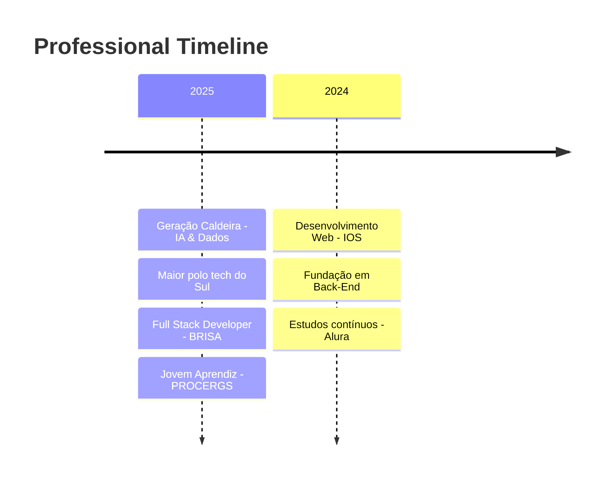

 

  
  <b>`Hallo Welt`</b>
  <samp>
       
     Willkommen! I'm <b>Matheus Fachel</b>
  </samp>

  

    
  
 

      
 
 
      

  

 

 
 

  

 
 

  
  

      <samp>
        <b>More Info</b>
      </samp>
  

  
   

  <!-- Detailed Activity Graph -->
  

    
  

   

  <!-- Main Stats Grid -->
  

    
    
  
  

 

##

 

  <samp>
    <b>
      Contact me:
    </b>
  </samp>
   
   

  
  
  
  
  

 
 

##

 

  <samp>
    <b>
      About Me
    </b>
  </samp>

 

  

 

  <samp>
    <b>Oi! Eu sou o Matheus Fachel 👋</b>
  </samp>
    
  

    Desenvolvedor apaixonado por tecnologia e aprendizado constante. 
    Concluí o ensino médio recentemente e iniciei minha trajetória em Desenvolvimento Web pelo <strong>IOS</strong> (Instituto da Oportunidade Social), 
    com base sólida em Back-End e estudos contínuos pela <strong>Alura</strong>.
  

   
  

    Em <strong>2025</strong>, embarquei no <strong>Geração Caldeira</strong>, trilha de <strong>IA & Dados</strong>, 
    uma oportunidade incrível de crescer dentro do maior polo de tecnologia do Sul do Brasil.
  

 

  <samp>
    <b>🚀 Current Projects & Focus</b>
  </samp>

 

| 🏢 **BRISA Development** | 💻 **PROCERGS/SUSTENTARE** | 🎓 **Geração Caldeira** |
|:------------------------:|:---------------------------:|:------------------------:|
| Software de Gerenciamento | Recondicionamento de PCs | IA & Data Science |
| Ciclo completo de desenvolvimento | Equipamentos pós-enchentes RS | Maior polo tech do Sul |
| Stakeholders → Entrega | Manutenção preventiva | Aprendizado contínuo |

 

  
  
  
  
  

 

  <samp>
    <b>💼 Professional Journey</b>
  </samp>

 

 

| 🏢 **Position** | 📅 **Period** | 📍 **Location** | 🛠️ **Focus** |
|:---------------:|:-------------:|:---------------:|:-------------:|
| **Full Stack Developer** | ago/2025 - atual | Canoas/RS (Híbrido) | Software de Gerenciamento - Python & PostgreSQL |
| **Jovem Aprendiz - Técnico** | jan/2025 - atual | PROCERGS/RS | Manutenção de PCs & Projeto SUSTENTARE |
| **Estudante Desenvolvimento Web** | 2024 | IOS + Alura | Fundação Back-End & Aprendizado Contínuo |

 

  
  
  

###

<h3 align="center">Languages</h3>

###

  
  
  
  
  
  
  

###

<h3 align="center">Frontend Development</h3>

###

  
  
  
  
  

###

<h3 align="center">Backend Development</h3>

###

  

###

<h3 align="center">AI/ML and Database</h3>

###

  
  
  
  
  

###

<h3 align="center">Others</h3>

###

  
  
  
  
  
  
  
  
  

 

 
 

